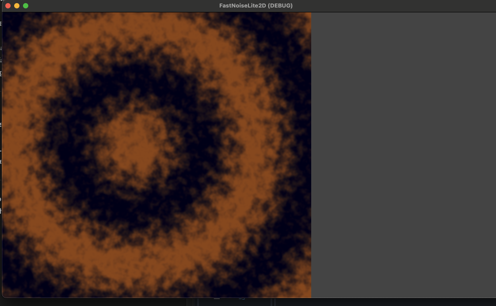
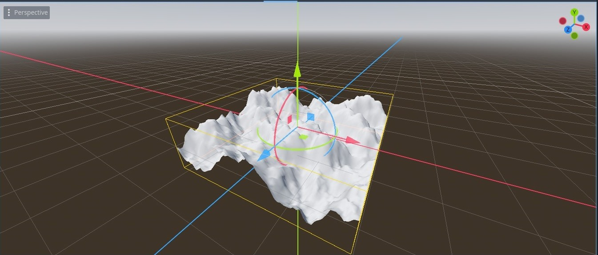

# COMP360 — 2D and 3D Images

We generated a 2D image with FastNoiseLite using multiple octaves of cellular noise and created a grid of 3D quads with the height of their vertices controlled by an image created using FastNoiseLite for a more natural-looking landscape.

## Roles (7 people)

We each created our own images and we voted on which 2D and 3D images to use for our submission.  
We voted on our discord and we decied to use Easton's image for the 2D image and for the 3D image, to use Bilal's image.

## Scripts

Easton's Code:

[WoodGrain2DImage.gd](Scripts/2D/WoodGrain2DImage.gd)

2D Image:

Bilal's Code:

[mesh_instance_3d.gd](Scripts/3D/mesh_instance_3d.gd)

3D Image:

## Scenes

Easton's code:

[wood_grain_2d.tscn](Scenes/wood_grain_2d.tscn)

Bilal's code:

