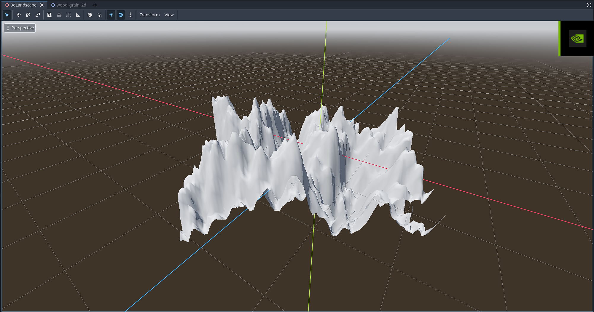

# COMP360 — 2D and 3D Images

We generated a 2D image with FastNoiseLite using multiple octaves of cellular noise and created a grid of 3D quads with the height of their vertices controlled by an image created using FastNoiseLite for a more natural-looking landscape.

## Planning and Logging

- All members created their own 2D and 3D attempts. 
- We shared and voted on Discord to decide which images to submit.
- Proof of this discussion is included here: [View all Discord proof screenshots](2D%20and%203D%20Image%20Attempts)

## Scripts

Easton's Code:

[WoodGrain2DImage.gd](Scripts/2D/WoodGrain2DImage.gd)

2D Image:

Bilal's Code:

Based on his research ([YouTube tutorial](https://www.youtube.com/watch?v=6qim01M1Yp0)).

[mesh_instance_3d.gd](Scripts/3D/mesh_instance_3d.gd)

3D Image:

## Scenes

Easton's code:

[wood_grain_2d.tscn](Scenes/2D/wood_grain_2d.tscn)

Bilal's code:

[3dLandscape.tscn](Scenes/3D/3dLandscape.tscn)